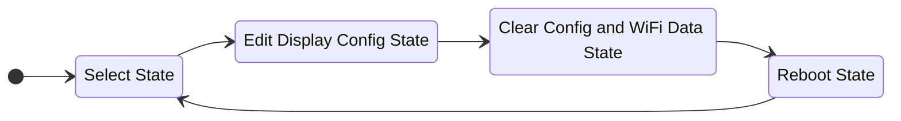
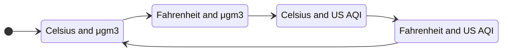

# Startup Config State Machine

Typically when the AirGradient is powered on it will cycle through a few general steps:

- Warming up the sensors
- Connecting to a saved WiFi Access Point or hosting its own AP for config purposes
- Beginning operation

If the user holds the push button on the back of the AirGradient while powering it on, it will enter the Config State Machine. A short press (essentially a click) will cycle through the options. A long press (greater than 4 seconds) will select the current option. The display on the front of the AirGradient will indicate which state it is currently in.

## Select an Option

These are the initial states that the AirGradient will run through:

| State | Description   |
| :--- | :---           |
| **Select State** | This state lets the user know they are in the Config State Machine and that they should cycle through and select an option.|
| **Edit Display Config State** | Long-pressing this state will enter the Display Config flow - [see the section below for details](#edit-the-display-configuration).|
| **Clear Config and WiFi Data State** | Long-pressing this state will clear the local storage, erasing the saved Display Config State, WiFi configuration, and MQTT configuration.|
| **Reboot State** | Long-pressing this state will restart the AirGradient equivalent to disconnecting and reconnecting the power. User should choose this to exit the flow.|

## Edit the Display Configuration

If users long-press the **Edit Display Config State** they will enter this flow. The user may select what the Display should show during regular operation. Short-pressing will cycle through each option. Long-pressing on an option will save that to the local storage, and return the user to the **Select State** from the [previous flow](#select-an-option).

