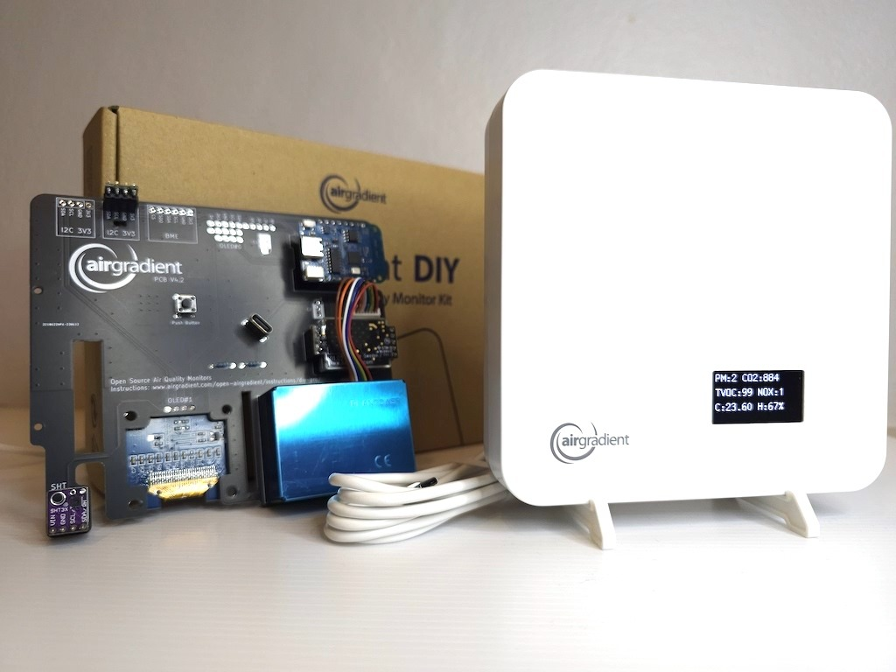

# What is AirGradient?

AirGradient is a company that designs, builds, and sells air quality sensors that are are open-source and open-hardware. The electronic schematics for the PCB, the firmware code, and the CAD files for the case are free and available. Their products are repair-friendly, do not require any subscription (unless you want to use their service), and can be entirely self-hosted. AirGradient has more info about who they are [here](https://www.airgradient.com/press/), and have a manifesto written [here](https://www.airgradient.com/manifesto/).

## The Air Quality Monitors

If you want to buy completely build or partially-built products, AirGradient offers a variety of indoor and outdoor air quality sensors. They come with different sensors, and many versions can be upgraded later by buying and installing sensors later. The code in this repo targets the AirGradient Pro v2.4, and you're free to upgrade an AirGradient's functionality and tweak it how you see fit. If you decide to purchase a different AirGradient product, you can modify this code to meet that goal.
