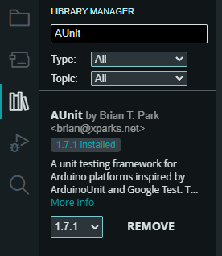

# Getting Started

## Flashing this firmware to your AirGradient

1. Setup your environment by downloading and installing one or more of the following options:
    1. [Arduino IDE](https://www.arduino.cc/en/software)
    1. [Arduino CLI](https://arduino.github.io/arduino-cli/0.19/installation/)
    1. [VS Code](https://code.visualstudio.com/) with the [Arduino extension](https://marketplace.visualstudio.com/items?itemName=vsciot-vscode.vscode-arduino) to your system.
1. Clone this repo or download the latest release (a zip of the source code).
1. Open `airgradient_mqtt.ino` with your chosen Arduino tools.
1. Install all required Arduino reference libraries.
1. Plug in the microcontroller for your AirGradient (such as an ESP8266 Wemos LOLIN D1 mini) and upload the sketch to the controller.

## Automated Tests

This project leverages [AUnit](https://github.com/bxparks/AUnit) to facilitate building automated tests and [EpoxyDuino](https://github.com/bxparks/EpoxyDuino) to mock an Arduino on a PC and run continuous integration.

### Setting up your environment

I ran tests using Windows Subsystem for Linux (WSL). Follow these steps to get started - you may be able to skip several steps on a standard Linux distro or macOS.



1. Install the AUnit library within the Arduino environment of your choice.
1. [Setup and configure WSL](https://learn.microsoft.com/en-us/windows/wsl/install).
    1. At the time of this running, the provided Ubuntu distro requires an `apt update` before proceeding.
    1. EpoxyDuino requires a C++ compiler and make. Add them to your install with `apt install g++` and `apt install make`.
1. Clone the [EpoxyDuino](https://github.com/bxparks/EpoxyDuino) repo and place it within the `user/Documents/Arduino/libraries` folder (this is not a required location, but this project is setup assuming EpoxyDuino is located here).
1. Add a `.env` file to the root of this project with the following format:

```bash
arduino_ide_dir=LOCATION_OF_ARDUINO_IDE
```

### Running tests

You are now ready to build and compile and run the tests. Follow these instructions to run all tests from the root of this project. I prefer to use the WSL terminal within VS Code for this purpose.

```bash
$ make -C tests clean

$ make -C tests tests
$ make -C tests runtests | grep failed
```

Alternatively, you can browse to the subfolder containing a specific subset of tests and run those directly.

```bash
$ make clean

$ make
$ make run
```